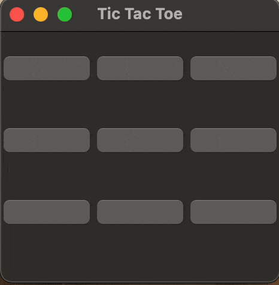

# TicTacToe
## Project Overview
This project is a simple implementation of the classic Tic Tac Toe game built with Python's Tkinter library. It provides a graphical user interface (GUI) for two players to play the game on the same computer. The game checks for a winner or a tie after each move and displays a message when the game ends.
## Requirements
- Python 3.x
- tkinter library (should be included with Python 3.x)
## Demo Gameplay
[
